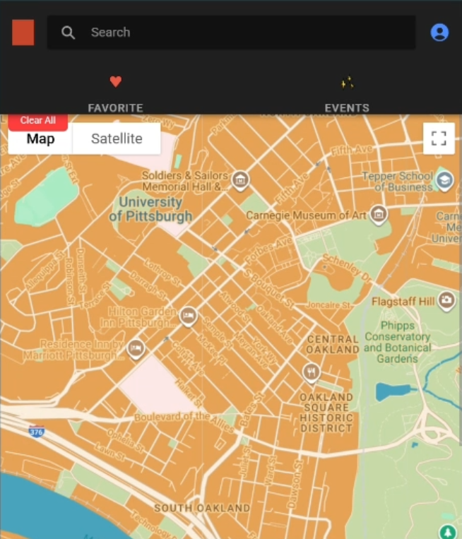
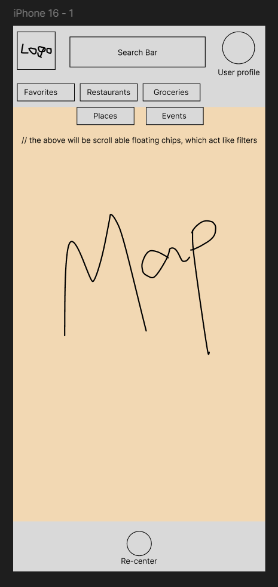

# LocAsian - Asian Cultural Experiences Map

A mobile application for discovering Asian restaurants and cultural experiences in your area.

## Live Demo

You can see the application in action here:

▶️ **[Watch the Project Demo Video](https://github.com/user-attachments/assets/1fef6f82-1c44-4f8d-a487-3febcca02ee1)**

> 💡 **Tip:** If the link above doesn't open instantly, you can also access the raw video file [directly here](./static/assets/CS1530%20-%20LocAsian%20Final%20Project%20(compressed).mp4).

## My Contributions (Shruti Mali)
**Role: Frontend Lead | Scrum Master | Product Owner**

- Took ownership of the app's interface and interactions, shaping product ideas into a usable mobile experience using **Ionic and React**.
- Created initial low-fidelity skeletons in **Figma**, which served as the functional guide; the final UI was refined during development process.
- Developed a **culturally themed Google Maps** interface using **Snazzy Maps tool**, applying warm, Asian-inspired color palettes informed by **Wu Xing (Five Elements) Philosophy** to create culturally and cohesive grounded visual system.
- Set up the environment, created the home page, integrated Google Maps functionality. 
- Iteratively adjusted layout structure, spacing, and **UI components** to improve clarity, coherence, and ease of use.
- Guided **sprint planning and feature prioritization** so user-facing functionality was delivered efficiently.
- Served as **Scrum Master** (Sprint 1), coordinating workflow and team tasks, and as **Product Owner** (Sprint 3-4), managing priorities and project goals, in addition to contributing as a developer. 

<p>Click on the images to enlarge</p>
<table>
    <tr>
        <th>
            Mobile Phone Preview
        </th>
        <th>
            Figma Preview
        </th>
    </tr>
    <tr>
        <td>
            
        </td>
        <td>
            
        </td>
    </tr>
</table>


### Choice of Colors and Their Relationship to Wu Xing Philosophy: 

<table>
  <thead>
    <tr>
      <th>
        Element
      </th>
      <th>
        Feature
      </th>
      <th>
        Hex Code
      </th>
      <th>
        Color Name
      <th>
        Significance
      </th>
    </tr>
  </thead>
  <tbody>
    <tr>
      <td>
        Earth
      </td>
      <td>
        Landmass
      </td>
      <td>
        #EA9D44
      </td>
      <td>
        Shade of Gold
      </td>
      <td>
        Prosperity and Stability
      </td>
    </tr>
    <tr>
      <td>
        Fire
      </td>
      <td>
        Logo
      </td>
      <td>
        #C6472B
      </td>
      <td>
        Dark Shade of Red
      </td>
      <td>
        Luck and Vitality
      </td>
    </tr>
    <tr>
      <td>
        Wood
      </td>
      <td>
        Parks
      </td>
      <td>
        #C6D9A6
      </td>
      <td>
        Sage Green
      </td>
      <td>
        Growth and Renewal
      </td>
    </tr>
    <tr>
      <td>
        Metal
      </td>
      <td>
        Roads
      </td>
      <td>
        #FBEEDC
      </td>
      <td>
        Off-white
      </td>
      <td>
        Clarity and Purity
      </td>
    </tr>
    <tr>
      <td>
        Water
      </td>
      <td>
        Water
      </td>
      <td>
        #3C8CA2
      </td>
      <td>
        Shade of Cyan
      </td>
      <td>
        Healing and Fluidity
      </td>
    </tr>
  </tbody>
</table>

> Note: This was a collaborative team project. Above README highlights my individual contributions. 

---

## Tech Stack

- **Frontend**: Ionic React, CSS, JSON, TypeScript
- **Backend**: Spring Boot (Java)
- **Database**: MySQL 8.0 (Docker)

## Project Structure

### Database Entities

The application uses 4 main entities, each with:
- A primary key of type `long` that auto-increments
- A `createdAt` field of type `LocalDateTime` to track creation time

**Users**: Stores login information for each user. Note that `userId` (primary key) is distinct from `username` (display name chosen by users).

**Event**: Contains event information with fields including `id` (primary key), `title` (String), and `body` (String) for description text.

**Favorite**: 'id', 'userID', 'restaurantName', 'createdAt'

**Review**: 'id' (primary key), 'body' text, userId (Int), rating (int)

## Setup Instructions

### 1. Start MySQL Database

From the project root directory:

```bash
docker compose up -d db
```

This starts a MySQL 8.0 container on port **3307**.

### 2. Run the Backend

From the `backend/rest` directory:

```bash
./mvnw spring-boot:run
```

Backend runs on: **http://localhost:8080**

### 3. Run the Frontend

From the `myApp` directory:

```bash
npm install
npm run dev
```

Frontend runs on: **http://localhost:8100**

## Testing with Postman

We use Postman to test HTTP requests (GET, POST, UPDATE, DELETE) to our MySQL database.

**Access the Postman Collection**: [Locasian Workspace](https://jakefulton1-3616627.postman.co/workspace/Locasian-Postman-Workspace~ae34f0bb-319f-432a-8820-064eeb15202a/collection/undefined?action=share&creator=50115094)

The collection is accessible to:
- All team members (edit access)
- Professor: vonfrankenberg@pitt.edu
- TA: hay149@pitt.edu

The collection can be accessed in browsers, or you can [download the Postman application](https://www.postman.com/downloads/).

## Team

CS 1530 - Software Engineering  
University of Pittsburgh  
- Katie Whiteford (Scrum Master)
- Shruti Mali (Product Owner)
- Xiaoting Wang (Developer)
- Jake Fulton (Developer)
- Kenneth Lin (Developer)
- Minakshi Thapa (Developer)
